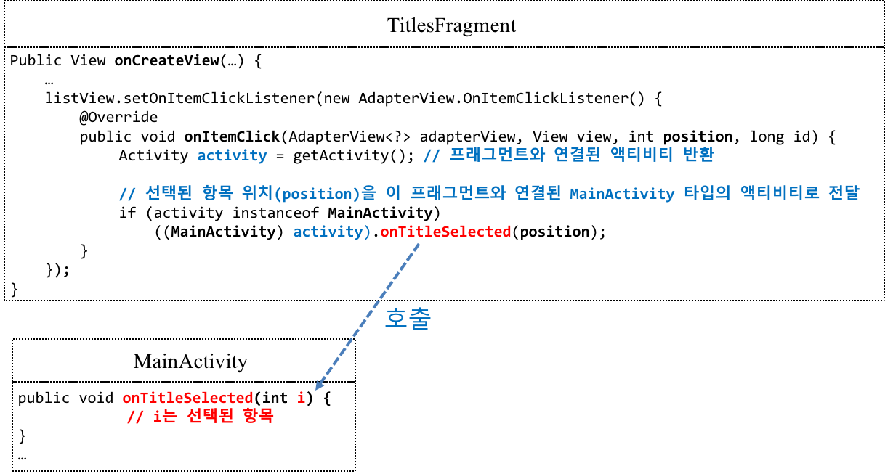

<style>
div.polaroid {
  	width: 640px;
  	box-shadow: 0 10px 30px 0 rgba(0, 0, 0, 0.2), 0 16px 30px 0 rgba(0, 0, 0, 0.19);
  	text-align: center;
	margin-bottom: 0.5cm;
}
</style>

[**이전 학습**: 프래그먼트 사용](fragment-usage.html)
# 프래그먼트 예제

## 학습목표
- 태블릿용 및 스마트폰용 디바이스에서 다른 화면을 구현하는 방법을 이해한다.
- 프래그먼트를 여러 액티비티에서 재사용할 수 있도록 프래그먼트와 액티비티 간의 통신 방법에 대해서 이해한다.


<a name="1"> </a>
## 1. 개요 - 태블릿과 스마트폰에서 다른 화면 구현하기

1. **TitlesFragment**에서는 제목을 ListView로 표시하고, **DetailsFragment**에서는 ListView에서 선택된 제목의 상세정보를 표시한다.
2. 태블릿에서는 **TitlesFragment**와 **DetailsFragment**가 나오고, 스마트폰의 경우에는 첫화면(MainActivity)에서 **TitlesFragment**만 나오고, ListView에 나열된 항목이 선택되면 해당 항목에 대한 상세정보를 표시하는 **DetailsFragment**를 다른 화면(DetailsActivity)으로 표시한다.


- **TitlesFragment**에서 표시된 ListView의 항목이 선택되었을 때, 해당 항목의 상세정보를 **DetailsFragment**에 어떻게 전달할 것인가?
	
	- **TitlesFragment**가 서로 다른 액티비티에서 재사용될 수 있도록 하기 위해서는 **TitlesFragment**가 **DetailsFragment**를 직접 접근하지 않도록 해야 합니다. 만약 **TitlesFragment**가 목록에서 선택된 내용을 **DetailsFragment**로 전달하기 위해서 **DetailsFragment**를 직접 접근하게 된다면 **TitlesFragment**는 **DetailsFragment**와 항상 같은 액티비티에 포함되어야 할 것입니다.

- 따라서, **TitlesFragment**의 목록에서 선택된 내용을 **DetailsFragment**로 전달할 때, 프래그먼트가 서로 종속적이지 않고 독립적으로 동작하게 하기 위해서는 아래 그림과 같이, 선택된 항목번호를 **MainActivity**로 보내고, **MainActivity**에서 다시 **DetailsFragment**로 보내는 방법을 취해야 합니다. 이에 대한 구체적인 방법은 이어지는 절에서 자세히 설명합니다.

		 

- **예제 프로젝트 소스**
	https://github.com/kwanulee/AndroidProgramming/tree/master/examples/TabletPhoneFragment


## 2. TitlesFragment 구현
-  제목 목록을 ListView로 보여주는 TitlesFragment를 구현한다.

	

### [[연습4] - 리스트뷰를 포함한 TitlesFragment 정의하기](exercise4.html) 


## 3. 액티비티와의 통신 방법
-  ListView의 선택된 항목 번호를 액티비티로 전달하는 방법을 이해한다.

	

---
### 3.1 (**방법1**) 액티비티에서 직접 구현된 메소드 호출
- **MainActivity**에 **void onTitleSelected(int i)** 메소드를 추가 정의
- ListView의 항목이 선택되었을 때 선택된 항목 위치를 **MainActivity**의 **onTitleSelected()**메소드를 호출하면서 파라미터로 전달

	

### [[연습5] - 프래그먼트-액티비티 통신 방법 (액티비티에서 직접 구현된 메소드 호출)](exercise5.html)

---
### 3.2 (**방법2**) 인터페이스를 구현한 액티비티를 인터페이스로 접근
-  **void onTitleSelected(int i)** 메소드를 포함한 인터페이스 **OnTitleSelectedListener**를 **TitlesFragment** 내부에 정의
-  **MainActivity**가 이 인터페이스를 구현하도록한 후, ListView의 항목이 선택되었을 때 선택된 항목 번호를 **MainActivity**가 구현한 인터페이스의 **onTitleSelected()**메소드를 호출하면서 파라미터로 전달
		
	

### [[연습6] - 프래그먼트-액티비티 통신 방법 (인터페이스를 구현한 액티비티를 인터페이스로 접근)](exercise6.html)

---
### 3.3 **두 방법의 비교**

	 | 장점 | 단점
	----|:----:|:----:
	방법1 | 간단한 구조 | 특정 Activity에 종속
	방법2 | 정의된 인터페이스를 구현하는 모든 Activity와 통신 가능 | 다소 복잡한 구조

	
## 4. 태블릿용 화면 레이아웃 추가
- 디바이스의 화면이 태블릿과 같이 큰 경우에 작은 크기의 화면과는 다른 화면 구성을 하고자 한다면, **res/layout\-large** 폴더에 MainActivity의 레이아웃 파일과 동일한 이름의 레이아웃 파일을 정의
	
	

### [[연습7]- 태블릿용 화면 레이아웃 추가하기](exercise7.html) 


## 5. DetailsFragment 구현
- ListView에서 선택한 항목 번호의 상세정보를 보여주는 DetailsFragment를 구현한다.
		

- TitlesFragment에서 리스트뷰 항목 선택 번호를 MainActivity로 전달하였으므로, MainActivity에서는 전달받은 항목 선택 번호를 다시 DetailsFragment로 넘긴다. 


---
### 5.1 프래그먼트로 인자 (argument) 전달 방법
- 인자를 프래그먼트로 전달하는 일반적인 패턴은 정적 메소드인 **newInstance()**를 사용하는 것입니다.
	1. **newInstance(parameter)** 메소드 정의
		- 프래그먼트 객체 생성합니다.
			- [**주의**] **new** 키워드로 프래그먼트 객체를 생성하였다고 하더라도 아직 프래그먼트 컴포넌트가 생성된 것은 아닙니다. 프래그먼트 컴포넌트의 생성은 **onCreate()** 프래그먼트 콜백메소드가 호출되는 시점에 생성됩니다. 
		- 매개변수 *parameter*를 통해 전달된 값을 프래그먼트의 [setArguments()](https://developer.android.com/reference/androidx/fragment/app/Fragment?hl=ko#setArguments(android.os.Bundle)) 메소드를 사용하여 프래그먼트 객체에 인자로 설정합니다.
		- 설정된 프래그먼트 객체를 반환합니다.
	
		```java
		public class DetailsFragment extends Fragment {
		    private static final String ARG_PARAM1 = "index";
		   		
		    public DetailsFragment() {
		        // Required empty public constructor
		    }
		
		    /**
		     * Use this factory method to create a new instance of
		     * this fragment using the provided parameters.
		     *
		     * @param index selected position in the ListView.
		     * @return A new instance of fragment DetailsFragment.
		     */
		    public static DetailsFragment newInstance(int index) {
		        DetailsFragment fragment = new DetailsFragment();
		        
		        Bundle args = new Bundle();  // 인자 값을 저장할  번들 객체 생성
		        args.putInt(ARG_PARAM1, index); // 인자 값을 (키,값) 페어로 번들 객체에 설정
		        fragment.setArguments(args);  // 인자값을 저장한 번들 객체를 프래그먼트로 전달
		        
		        return fragment;
		    }
		}
		```	
	
	2.  **onCreate()** 메소드 재정의  
		- 이 콜백 메소드가 호출되는 시점에 실질적인 프래그먼트 컴포넌트가 생성됩니다.
		- 이 시점부터 프래그먼트 객체에 설정된 인자를 [getArguments()]() 메소드를 사용하여 얻어올 수 있습니다.

		```java
		public class DetailsFragment extends Fragment {
		   private int mIndex;
		    @Override
		    public void onCreate(Bundle savedInstanceState) {
		        super.onCreate(savedInstanceState);
		        if (getArguments() != null) {
		            mIndex = getArguments().getInt(ARG_PARAM1);
		        }
		    }
		 }
		```
	3.  **newInstance(parameter)** 메소드를 통해 프래그먼트로 인자 전달

		```java
		public class MainActivity extends AppCompatActivity implements TitlesFragment.OnTitleSelectedListener{
		
		    //...
		    public void onTitleSelected(int i) {
		        if (getResources().getConfiguration().orientation
		                == Configuration.ORIENTATION_LANDSCAPE) {
		            
		            // DetailsFragment로 선택된 항목번호 i  전달
		            DetailsFragment detailsFragment = DetailsFragment.newInstance(i);
		            
		            getSupportFragmentManager().beginTransaction().replace(R.id.details, detailsFragment).commit();
		        } 
		    }
		}
		```
		
	

### [[연습8] - 선택된 항목의 상세정보를 보여주는 DetailsFragment 추가하기](exercise8.html)

## 6. 스마트폰용 **TitlesFragment**와 **DetailsFragment**을 스마트폰용에서 재사용


- 스마트폰의 경우에는 첫화면(**MainActivity**)에서 **TitlesFragment**만 나오고, ListView에 나열된 항목이 선택되면 해당 항목에 대한 상세정보를 표시하는 **DetailsFragment**를 다른 화면(**DetailsActivity**)으로 표시한다. 


1. **MainActivity**는 **DetailsActivity**에게 리스트뷰의 항목 선택 번호를 인텐트의 **Extra**를 통해 전달한다.
	- **onTitleSelected()** 메소드 수정
		- 파라미터로 전달받은 리스트뷰의 선택된 항목번호를 화면의 크기에 따라서 **DetailsFragment**와 **DetailsActivity** 중에 하나에게 전달될 수 있도록 수정
			- 화면크기를 판별하는 방법
				- [Configuration](https://developer.android.com/reference/android/content/res/Configuration.html) 클래스의 [isLayoutSizeAtLeast()](https://developer.android.com/reference/android/content/res/Configuration.html#isLayoutSizeAtLeast(int)) 메소드 이용

		```java
		public void onTitleSelected(int i) {
		        if (getResources().getConfiguration().isLayoutSizeAtLeast(Configuration.SCREENLAYOUT_SIZE_LARGE)) {
		            DetailsFragment detailsFragment = DetailsFragment.newInstance(i);
		            getSupportFragmentManager().beginTransaction().replace(R.id.details, detailsFragment).commit();
		        } else { 	// 화면 크기가 작은 경우
		            Intent intent = new Intent(this, DetailsActivity.class);
		            intent.putExtra("index", i);
		            startActivity(intent);
		        }
		    }
		``` 

2. **DetailsActivity**는 **MainActivity**로부터 전달받은 리스트뷰의 항목 선택 번호를 새로이 생성된 **DetailsFragment**에 전달하고 새로이 생성된 **DetailsFragment** 객체를 기존 것과 교체

	- **activity_details.xml**
		- DetailsFragment를 포함할 컨테이너로 FrameLayout을 정의 (id는 *details*로 설정됨)
			
			```xml
			<?xml version="1.0" encoding="utf-8"?>
			<LinearLayout xmlns:android="http://schemas.android.com/apk/res/android"
			    android:layout_width="match_parent"
			    android:layout_height="match_parent"
			    android:orientation="vertical">
			
			    <FrameLayout
			        android:id="@+id/details"
			        android:layout_width="match_parent"
			        android:layout_height="match_parent" />
			
			</LinearLayout>
			```

	- **DetailsActivity.java**

		```java
		public class DetailsActivity extends AppCompatActivity {
		
		    @Override
		    protected void onCreate(Bundle savedInstanceState) {
		        super.onCreate(savedInstanceState);
		        setContentView(R.layout.activity_details);
		
				// 액티비티로 전달된 인텐트의 Extra에서 이름이 "index"인 int형 값을 뽑아와서 새로이 생성된 DetailsFragment 객체에 전달
		        DetailsFragment details = DetailsFragment.newInstance(index);
						        
					        
		        // 새로이 생성된 DetailsFragment 객체를 기존 것과 교체
		        getSupportFragmentManager().beginTransaction().replace(R.id.details, details).commit();
		    }
		}
		```
		
## 핵심 정리
-  프래그먼트의 재사용을 위해서는 프래그먼트 간에 직접 통신은 배제해야 합니다. 
	-  프래그먼트 간의 통신은 그 들의 부모 액티비티를 통해서 이루어져야 합니다.
	
			 
- 프래그먼트와 부모 액티비티 간의 통신 방법
	1. 프래그먼트는 부모 액티비티가 구현할 인터페이스를 내부 타입으로 정의
	2. 부모 액티비티는 프래그먼트의 인터페이스를 구현
	3. 프래그먼트는 부모 액티비티의 인터페이스 구현을 이용하여 정보를 전달	
		
		
- 프래그먼트로 인자 전달하는 방법
	- newInstance()  팩토리 메소드 사용
	- getArguments() 메소드를 통해 프래그먼트로 전달된 인자 획득